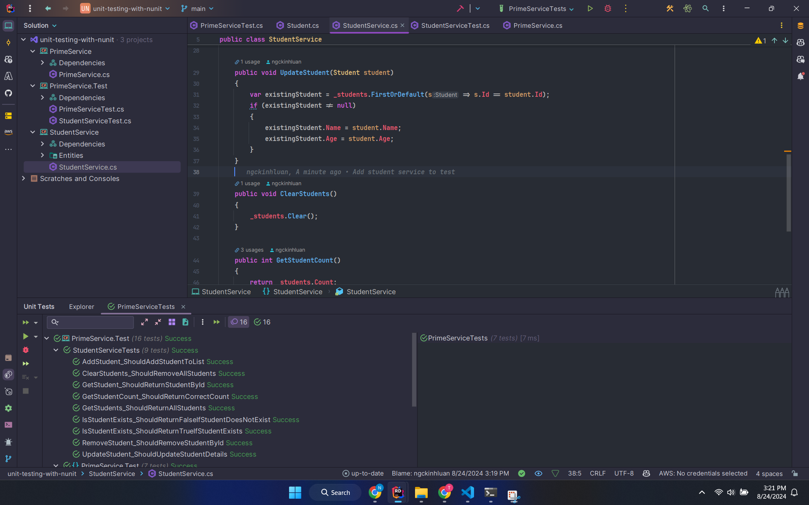

# Welcome to unit-testing-with-nunit Repository ver. 8.24.2024

## You will find in this repo the following stuff

* A Math Utility source code to demonstrate the Math library using C# and NuGet
* Student Service: Includes methods and functionality for managing students.
* A Unit Test test script using NUnit Testing Framework to ensure the quality of source code
* Test scripts to demonstrate TDD (Test-Driven Development), DDT (Data-Driven Testing), and regression testing techniques
* A CI (Continuous Integration) script to apply the CI process
* **Student Management Testing Demonstrations**: Showcases various methods related to managing students.

### Screenshots

#### Connect me via: luantnk2907@gmail.com

##### &#169; 2024 luan.tran
